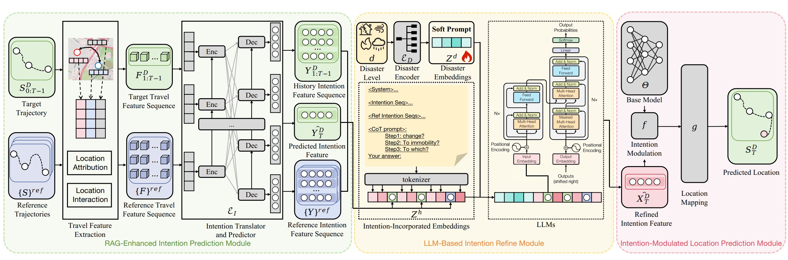

# DisasterMobLLM

DisasterMobLLM, a mobility prediction framework in disaster scenarios that can be integrated into existing mobility prediction models by leveraging LLMs to transfer the common knowledge of how different disasters affect human mobility patterns at the intention level. We use a RAG-Enhanced Intention Module to predict the next intention, introduce an LLM-based Intention Refine Module to refine the intention, and propose an Intention-Modulated Location Prediction Module to predict the next location.